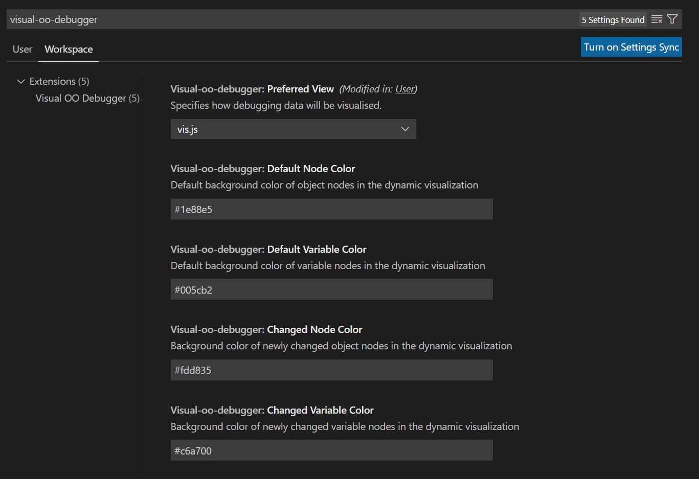

# Visual OO Debugger

A VS Code extension for visualizing debug information.

## Supported Languages

This extension was initially created with support for Java only.

## Usage

### Installation and Basic Use

After installing the extension from [VS Marketplace][marketplace], execute the command `VOOD: Open debugger view`
to open a new view for the visualization. Then execute your code in debug mode and continue the program step-by-step
and see the visualization update in the debugger view.

[marketplace]: https://marketplace.visualstudio.com/items?itemName=GinoCardilloOST.visual-oo-debugger

### Exporting a PNG

Execute the command `VOOD: Export as PNG` to create a PNG of the current state of the visualization.

### Recording a GIF

To start recording a GIF, use the command `VOOD: Start recording a GIF`. To end the recording, use the command
`VOOD: Stop recording a GIF`. For quicker use, create a key-mapping for those commands. After ending the recording,
the footage will be converted into a GIF. This process might take some time, so we recommend keeping the recording
as long as necessary and as short as possible.

### Exporting a PlantUML file

Execute the command `VOOD: Export as PlantUML` to create a PlantUML file of the current state of the visualization
or click on the `Visual Debugger` panel menu item `Export as PlantUML` instead.

### Exporting a GraphViz file

Execute the command `VOOD: Export as GraphViz` to create a GraphViz file of the current state of the visualization
or click on the `Visual Debugger` panel menu item `Export as GraphViz` instead.

### Back-Stepper

Use the buttons in the top left-hand corner of the view to load the previous or next state of the visualization.
Note that this will only change the state of the visualization and is not a way to step back/forward in the debugger.
Only states that have been visualized before may be loaded that way.

Only the states of the top stack frame are added to the history at each step.

### Stack Frame selection

Select a stack frame from the call stack in the dropdown at the top of the debugger view. The visualization will then
update and visualize the variables of the selected stack frame.

### Cluster Nodes

Left-click on a node to collapse it along with its references to other nodes. Left-click on the cluster to expand it again.
To expand all clusters at once, click on the 'Open all clusters' button in the upper right-hand corner of the view.

### Hide Nodes

Drag and drop a node or cluster onto the eye icon in the upper right-hand corner of the view to hide it. All hidden
nodes and clusters can be revealed by clicking on the eye icon.

## Extension Settings

### Visualization Styles

By default, [vis.js](https://visjs.org/) is used to visualize the debug information. The preferred view can be changed
in the User/Workspace settings.

### Customizable Colors

The colors of nodes can be changed in the User/Workspace settings. The colors of edges and text on nodes are derived
from the selected node colors.
